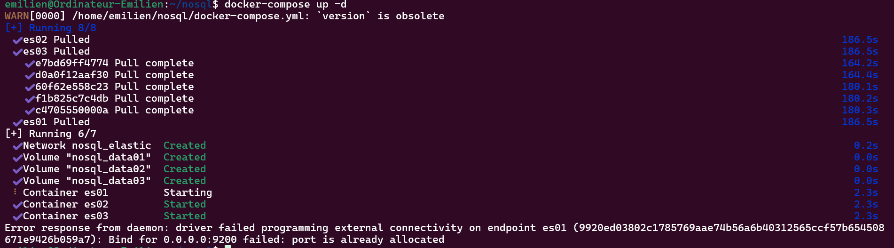
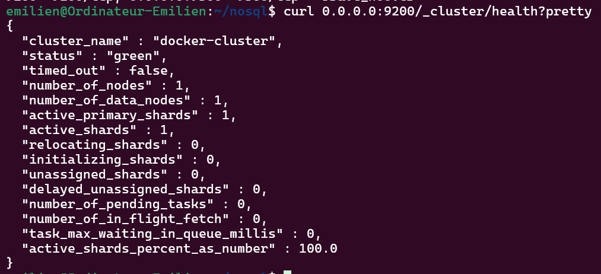
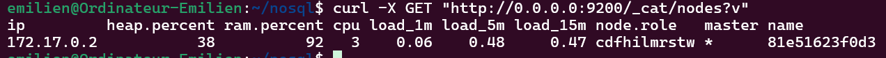

# Configurer une architecture multi-nœuds Docker

## Lancer le cluster
Créer le fichier "docker-compose.yml" suivant :
```
version: '3'
services:
  es01:
    image: docker.elastic.co/elasticsearch/elasticsearch:7.15.0
    container_name: es01
    environment:
      - node.name=es01
      - node.roles=master
      - cluster.name=es-docker-cluster
      - bootstrap.memory_lock=true
      - "ES_JAVA_OPTS=-Xms512m -Xmx512m"
      - "discovery.seed_hosts=es02,es03"
      - "cluster.initial_master_nodes=es01,es02,es03"
    ulimits:
      memlock:
        soft: -1
        hard: -1
    volumes:
      - data01:/usr/share/elasticsearch/data
    ports:
      - 9200:9200
    networks:
      - elastic

  es02:
    image: docker.elastic.co/elasticsearch/elasticsearch:7.15.0
    container_name: es02
    environment:
      - node.name=es02
      - node.roles=data
      - cluster.name=es-docker-cluster
      - bootstrap.memory_lock=true
      - "ES_JAVA_OPTS=-Xms512m -Xmx512m"
      - "discovery.seed_hosts=es01,es03"
      - "cluster.initial_master_nodes=es01,es02,es03"
    ulimits:
      memlock:
        soft: -1
        hard: -1
    volumes:
      - data02:/usr/share/elasticsearch/data
    networks:
      - elastic

  es03:
    image: docker.elastic.co/elasticsearch/elasticsearch:7.15.0
    container_name: es03
    environment:
      - node.name=es03
      - node.roles=ingest
      - cluster.name=es-docker-cluster
      - bootstrap.memory_lock=true
      - "ES_JAVA_OPTS=-Xms512m -Xmx512m"
      - "discovery.seed_hosts=es01,es02"
      - "cluster.initial_master_nodes=es01,es02,es03"
    ulimits:
      memlock:
        soft: -1
        hard: -1
    volumes:
      - data03:/usr/share/elasticsearch/data
    networks:
      - elastic

volumes:
  data01:
    driver: local
  data02:
    driver: local
  data03:
    driver: local

networks:
  elastic:
    driver: bridge
```

Puis faire :
```
docker-compose up -d
```



## Vérifier que le cluster fonctionne
### Vérifier l’état du cluster :
```
curl 0.0.0.0:9200/_cluster/health?pretty
```
- L’état doit être "green" ou "yellow" (évite "red" = problème).



### Voir les nœuds du cluster :
```
curl -X GET "http://0.0.0.0:9200/_cat/nodes?v"
```
- Affiche la liste des nœuds avec leur rôle.



