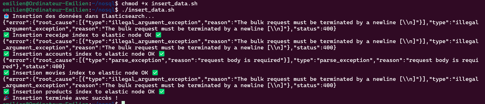
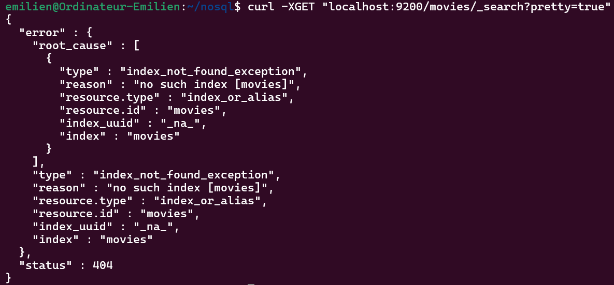

# 📌 Indexation des données dans Elasticsearch

## 📂 Fichier `insert_data.sh`

```bash
echo "📤 Insertion des données dans Elasticsearch..."

curl -s -H "Content-Type: application/x-ndjson" -XPOST localhost:9200/receipe/_bulk --data-binary "@receipe.json" &&\
printf "\n✅ Insertion receipe index to elastic node OK ✅ \n"

curl -s -H "Content-Type: application/x-ndjson" -XPOST localhost:9200/accounts/_bulk --data-binary "@accounts.json" &&\
printf "\n✅ Insertion accounts index to elastic node OK ✅ \n"

curl -s -H "Content-Type: application/x-ndjson" -XPOST localhost:9200/movies/_bulk --data-binary "@movies.json" &&\
printf "\n✅ Insertion movies index to elastic node OK ✅ \n"

curl -s -H "Content-Type: application/x-ndjson" -XPOST localhost:9200/products/_bulk --data-binary "@products.json" &&\
printf "\n✅ Insertion products index to elastic node OK ✅ \n"

echo "🎉 Insertion terminée avec succès !"
```

## 🚀 Lancement du script

```bash
chmod +x insert_data.sh
./insert_data.sh
```



ℹ️ *Sur l'image ci-dessus, l'indexation ne fonctionne pas. Le problème a été résolu en créant et remplissant les fichiers JSON avec la commande :*
```bash
nano nom_du_fichier.json
```

---

## ✅ Vérification des données

### 🔍 Liste des index disponibles

```bash
curl -XGET "localhost:9200/_cat/indices?v"
```


### 🎬 Recherche de tous les documents dans l'index `movies`

```bash
curl -XGET "localhost:9200/movies/_search?pretty=true"
```

