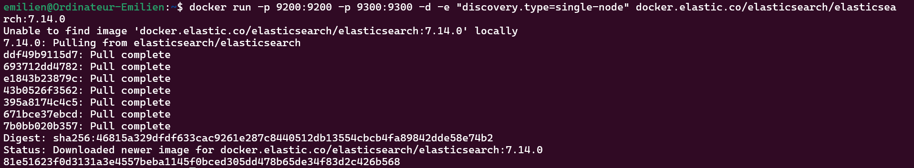
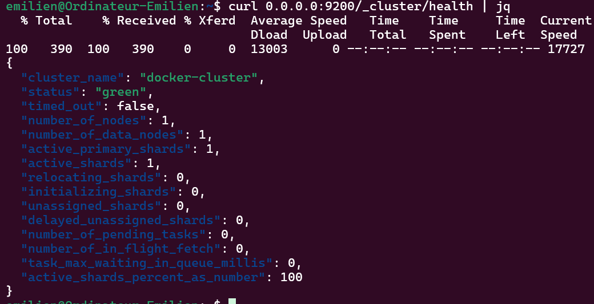
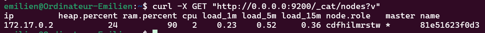

# Lancement d'un conteneur Elasticsearch :

```
docker run -p 9200:9200 -p 9300:9300 -d -e "discovery.type=single-node" docker.elastic.co/elasticsearch/elasticsearch:7.14.0
```

- Ports 9200 et 9300 : communication avec Elasticsearch et entre les nœuds.
- Mode détaché (-d) : exécution en arrière-plan.
- Mode single-node : pour le développement/test.



## Vérification de l’installation :

```
curl 0.0.0.0:9200/_cluster/health | jq
```



## Lister les nœuds du cluster

```
curl -X GET "http://0.0.0.0:9200/_cat/nodes?v"
```



