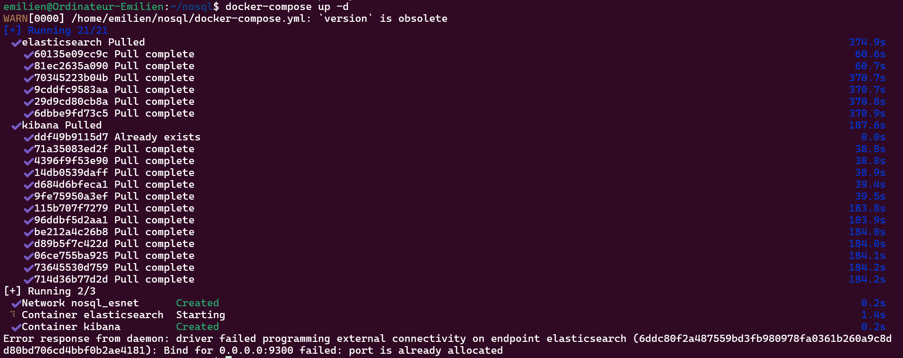
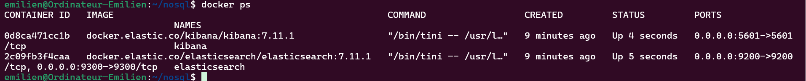
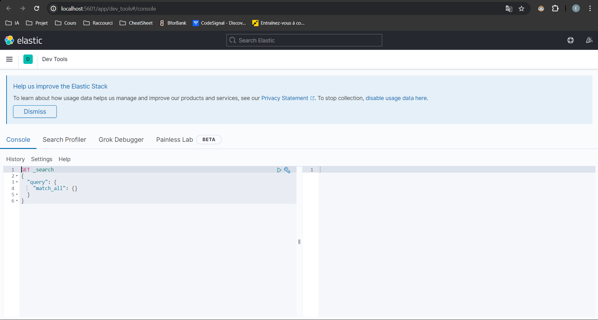
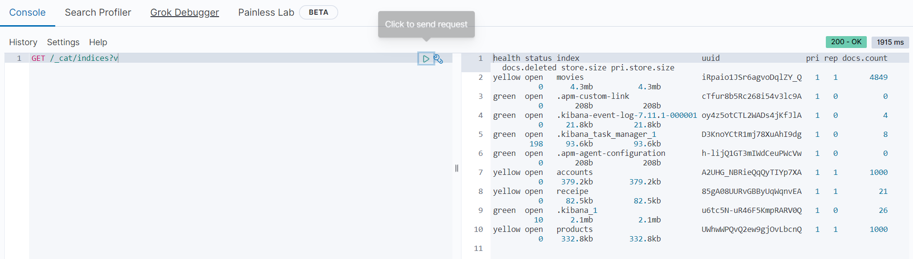
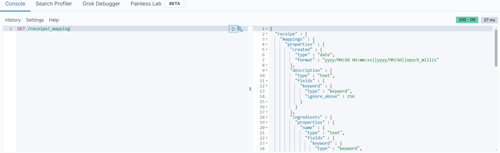
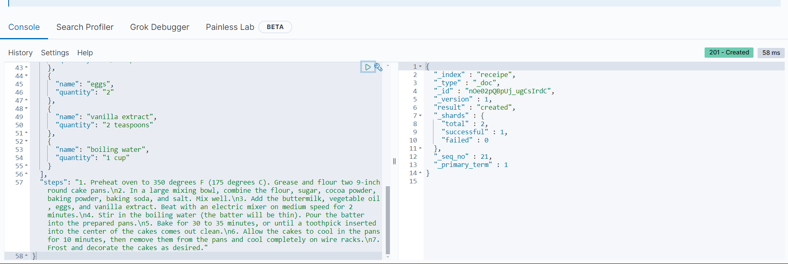
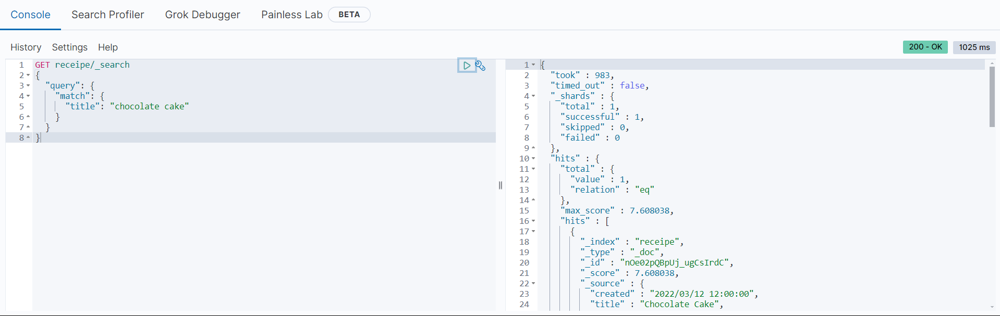
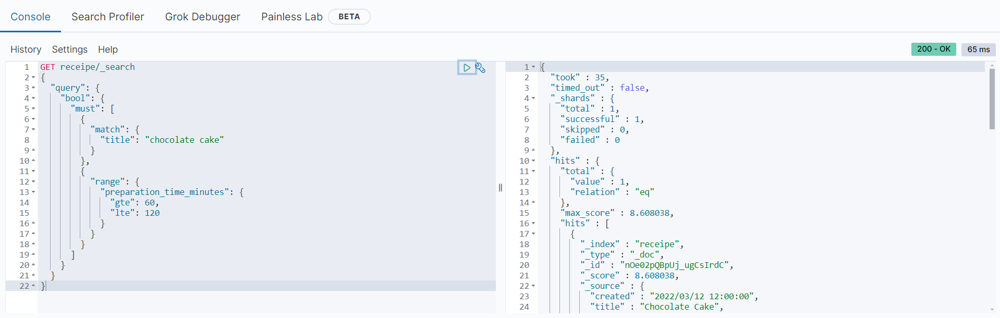

# Lancement de Kibana et Elasticsearch avec Docker Compose

Créer le fichier "docker-compose.yml" :
```
version: '2.2'
services:
  elasticsearch:
    image: docker.elastic.co/elasticsearch/elasticsearch:7.11.1
    container_name: elasticsearch
    restart: always
    environment:
      - xpack.security.enabled=false
      - discovery.type=single-node
    ulimits:
      memlock:
        soft: -1
        hard: -1
      nofile:
        soft: 65536
        hard: 65536
    cap_add:
      - IPC_LOCK
    volumes:
      - ./elas1:/usr/share/elasticsearch/data
    ports:
      - 9200:9200
      - 9300:9300
    networks:
      - esnet

  kibana:
    container_name: kibana
    image: docker.elastic.co/kibana/kibana:7.11.1
    restart: always
    ports:
      - 5601:5601
    depends_on:
      - elasticsearch
    networks:
      - esnet

networks:
  esnet:
    driver: bridge
```

Puis faire : 
```
docker-compose up -d
```


Il faut donner des permissions comme suivant :
```
sudo chmod -R 777 ./elas1/
```


### Teste vérif des indices :


## Récupération du mapping
```
GET /receipe/_mapping
```


# CRUD dans Elasticsearch
## Créer des docs
```
POST receipe/_doc
{
  "created": "2022/03/12 12:00:00",
  "title": "Chocolate Cake",
  "description": "A rich and decadent chocolate cake recipe",
  "preparation_time_minutes": 60,
  "servings": {
    "min": 8,
    "max": 10
  },
  "ingredients": [
    {
      "name": "flour",
      "quantity": "2 cups"
    },
    {
      "name": "sugar",
      "quantity": "2 cups"
    },
    {
      "name": "cocoa powder",
      "quantity": "3/4 cup"
    },
    {
      "name": "baking powder",
      "quantity": "2 teaspoons"
    },
    {
      "name": "baking soda",
      "quantity": "2 teaspoons"
    },
    {
      "name": "salt",
      "quantity": "1 teaspoon"
    },
    {
      "name": "buttermilk",
      "quantity": "1 cup"
    },
    {
      "name": "vegetable oil",
      "quantity": "1/2 cup"
    },
    {
      "name": "eggs",
      "quantity": "2"
    },
    {
      "name": "vanilla extract",
      "quantity": "2 teaspoons"
    },
    {
      "name": "boiling water",
      "quantity": "1 cup"
    }
  ],
  "steps": "1. Preheat oven to 350 degrees F (175 degrees C). Grease and flour two 9-inch round cake pans.\n2. In a large mixing bowl, combine the flour, sugar, cocoa powder, baking powder, baking soda, and salt. Mix well.\n3. Add the buttermilk, vegetable oil, eggs, and vanilla extract. Beat with an electric mixer on medium speed for 2 minutes.\n4. Stir in the boiling water (the batter will be thin). Pour the batter into the prepared pans.\n5. Bake for 30 to 35 minutes, or until a toothpick inserted into the center of the cakes comes out clean.\n6. Allow the cakes to cool in the pans for 10 minutes, then remove them from the pans and cool completely on wire racks.\n7. Frost and decorate the cakes as desired."
}
```


## Requête de correspondance
```
GET receipe/_search
{
  "query": {
    "match": {
      "title": "chocolate cake"
    }
  }
}
```


## Requête booléenne
```
GET receipe/_search
{
  "query": {
    "bool": {
      "must": [
        {
          "match": {
            "title": "chocolate cake"
          }
        },
        {
          "range": {
            "preparation_time_minutes": {
              "gte": 60,
              "lte": 120
            }
          }
        }
      ]
    }
  }
}
```


Et encore d'autre requêtes (flemme de tout scream)