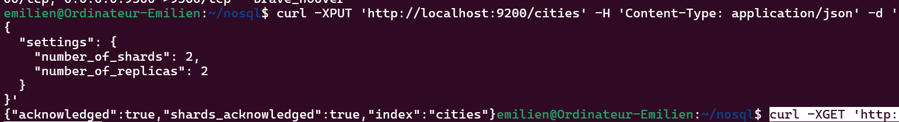
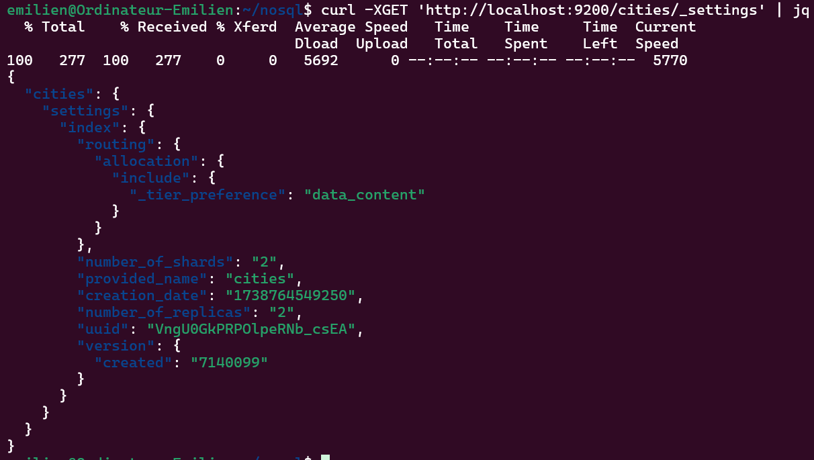
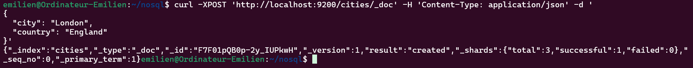
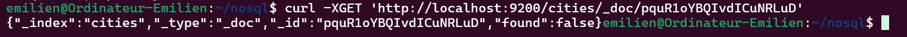

# 🏙️ Modélisation des données dans Elasticsearch

## 📌 Création d’un index

```bash
curl -XPUT 'http://localhost:9200/cities' -H 'Content-Type: application/json' -d '
{
  "settings": {
    "number_of_shards": 2,
    "number_of_replicas": 2
  }
}'
```



---

## 🔍 Vérification des paramètres de l'index

```bash
curl -XGET 'http://localhost:9200/cities/_settings' | jq
```



---

## 📥 Insertion de données dans l'index

### ➕ Insertion d’un document

```bash
curl -XPOST 'http://localhost:9200/cities/_doc' -H 'Content-Type: application/json' -d '
{
  "city": "London",
  "country": "England"
}'
```



### ✅ Vérification de l’insertion

```bash
curl -XGET 'http://localhost:9200/cities/_doc/pquR1oYBQIvdICuNRLuD'
```



---

## 📜 Format de retour

La réponse de la commande GET montre plusieurs champs :
- **`index`** : Le nom de l'index où se trouve le document.
- **`type`** : Le type de document.
- **`id`** : L'identifiant unique du document.
- **`version`** : La version du document.
- **`_source`** : Le contenu réel du document (dans ce cas, les informations sur la ville et le pays).