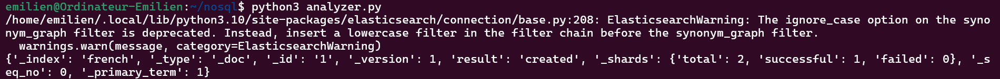
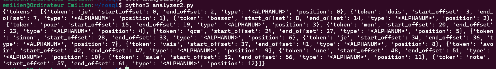

# Lancer elasticsearch avec docker
```
docker pull docker.elastic.co/elasticsearch/elasticsearch:7.11.1
docker run -p 9200:9200 -p 9300:9300 -e "discovery.type=single-node" docker.elastic.co/elasticsearch/elasticsearch:7.11.1
```


```
docker pull
```


```
docker pull docker.elastic.co/elasticsearch/elasticsearch:7.11.1
```


```
docker run -p 9200:9200 -p 9300:9300 -d -e "discovery.type=single-node" docker.elastic.co/elasticsearch/elasticsearch:7.11.1
```


```
docker exec -it 9d717b963a5dcdfcaa59884114d90eb2d8ffd1abba3d8b08e75fcf6979b4199e bash
```


```
docker restart 9d717b963a5dcdfcaa59884114d90eb2d8ffd1abba3d8b08e75fcf6979b4199e
```


```
curl -X GET "http://localhost:9200/_cat/plugins?v"
```


```
curl -X PUT "http://localhost:9200/french" -H "Content-Type: application/json" -d '{
  "settings": {
    "analysis": {
      "filter": {
        "french_elision": {
          "type": "elision",
          "articles_case": true,
          "articles": ["l", "m", "t", "qu", "n", "s", "j", "d", "c", "jusqu", "quoiqu", "lorsqu", "puisqu"]
        },
        "french_synonym": {
          "type": "synonym",
          "ignore_case": true,
          "expand": true,
          "synonyms": [
            "réviser, étudier, bosser",
            "mayo, mayonnaise",
            "grille, toaste"
          ]
        },
        "french_stemmer": {
          "type": "stemmer",
          "language": "light_french"
        }
      },
      "analyzer": {
        "french_heavy": {
          "tokenizer": "icu_tokenizer",
          "filter": [
            "french_elision",
            "icu_folding",
            "french_synonym",
            "french_stemmer"
          ]
        },
        "french_light": {
          "tokenizer": "icu_tokenizer",
          "filter": [
            "french_elision",
            "icu_folding"
          ]
}'} } } }
```


## Installation d'une librairie python pour elasticsearch
```
pip install "elasticsearch<7.14"
```


## Création du fichier analyzer.py
```
from elasticsearch import Elasticsearch
es = Elasticsearch('http://localhost:9200')

doc1 = {"text" : "Une phrase en français 🙂 ..."}
response = es.index(index="french", id=1, body=doc1)

print(response)
```

### Lancement du fichier :


## Créatiuon du fichier analyzer2.py
```
from elasticsearch import Elasticsearch

es = Elasticsearch("http://localhost:9200")

response = es.indices.analyze(index="french", body={
    "text": "Je dois bosser pour mon QCM sinon je vais avoir une sale note :( ..."
})

print(response)
```

### Lancement du fichier :
