# Opérations CRUD

## Cordes
### Créer/Mettre à jour
#### Définir une valeur de chaîne sur une clé :
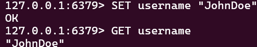

#### Définir une valeur avec un délai d'expiration (en secondes) :

### Lire
#### Obtenir la valeur d'une clé :

#### Obtenir plusieurs valeurs à l’aide de plusieurs clés :
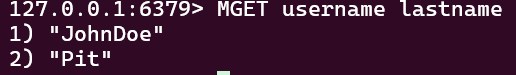

### Supprimer
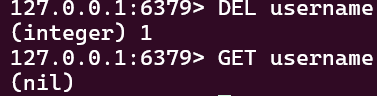

## Hachages
### Créer/Mettre à jour
#### Définir une valeur de champ dans un hachage :
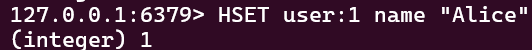

#### Définir plusieurs valeurs de champ dans un hachage :
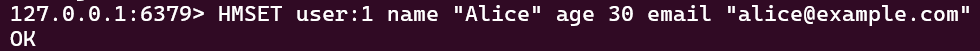

### Lire
#### Obtenir la valeur d'un champ dans un hachage :
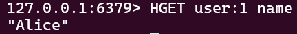

#### Obtenir plusieurs valeurs de champ dans un hachage :
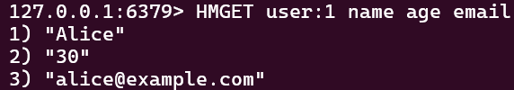

#### Obtenir tous les champs et valeurs dans un hachage :
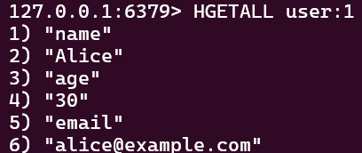

#### Supprimer un champ d'un hachage :
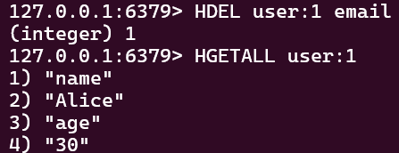

## Listes
### Créer/Mettre à jour
#### Ajouter des éléments à l'en-tête (à gauche) d'une liste :
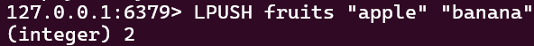

#### Ajouter des éléments à la fin (à droite) d'une liste :
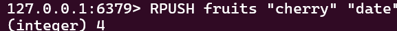

### Lire
#### Obtenir des éléments d'une liste par plage d'index :
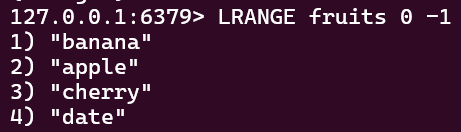

#### Obtenir un élément d'une liste par index :
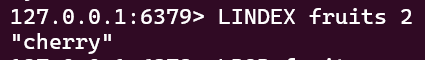

### Supprimer
#### Supprimer des éléments de l'en-tête (à gauche) d'une liste :
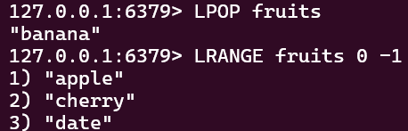

#### Supprimer des éléments de la fin (à droite) d'une liste :
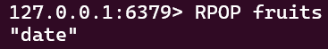

#### Supprimer un élément d'une liste par sa valeur :
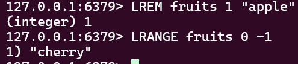

## Ensembles
### Créer/Mettre à jour
#### Ajouter des éléments à un ensemble :
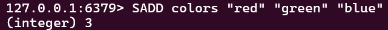

### Lire
#### Obtenir tous les éléments d'un ensemble :
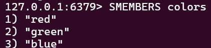

#### Vérifier si un élément est membre d'un ensemble :
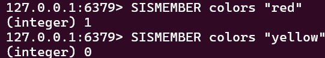

### Supprimer
#### Supprimer des éléments d'un ensemble :
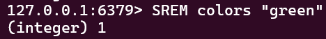

#### Supprimer et renvoyer un élément aléatoire d'un ensemble :
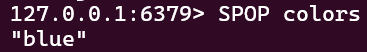

## Ensembles triés
### Créer/Mettre à jour
#### Ajouter des éléments avec des scores à un ensemble trié :
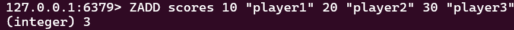

#### Mettre à jour le score d'un élément dans un ensemble trié :
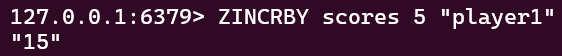

### Lire
#### Obtenir des éléments d'un ensemble trié par plage d'index :
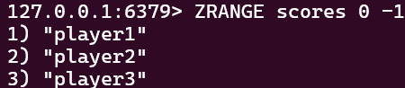

#### Obtenir des éléments d'un ensemble trié par plage de scores :
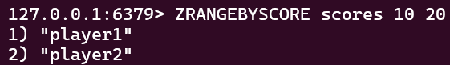

### Supprimer
#### Supprimer des éléments d'un ensemble trié :
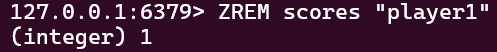

#### Supprimer des éléments d'un ensemble trié par plage d'index :
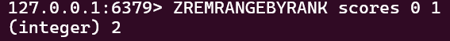

#### Supprimer des éléments d'un ensemble trié par plage de scores :
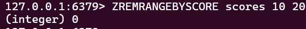
Normal que rien ne soit supprimé, c'est vide à cause des suppressions antérieurs