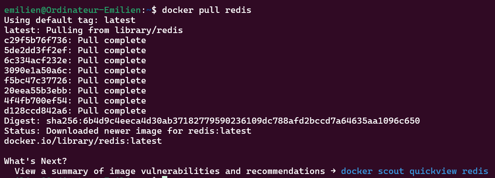
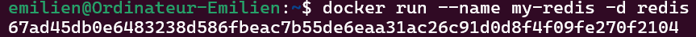
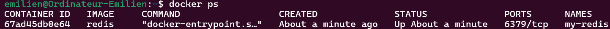
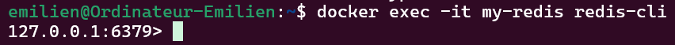
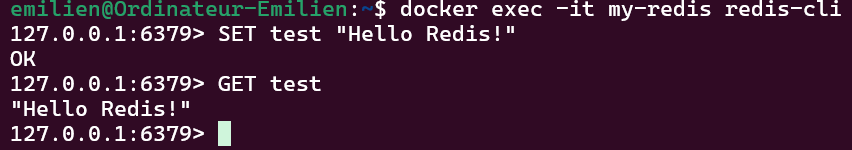

# Installation de Redis à l'aide de Docker

## Extraire l’image Redis de Docker Hub

## Démarrage du conteneur Redis

## Vérification du démarrage

## Connexion au conteneur Redis

## Test de la connexion
